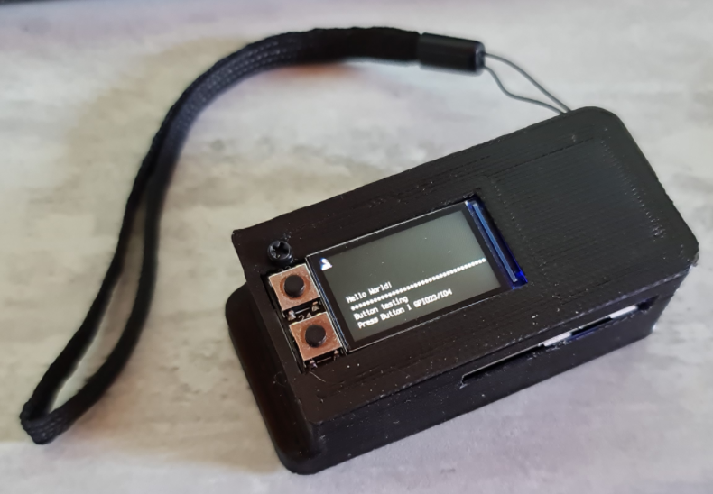

<h1>ATMegaZero S2 section</h1>

helpfull pin to pin name table 

example code can be found for [Adafruit PiTFT  1.13 240x135 pixels PI hat](https://github.com/beboxos/circuitpython/tree/main/ATMegaZero%20S2/Adafruit%20PiTFT%201.13%20240x135)

<h1>Lite boot menu application launcher</h1>

In [this section](https://github.com/beboxos/circuitpython/tree/main/ATMegaZero%20S2/BootMenu) you can find my BootMenu application laucher made for my ATMegaZero S2 + Adafruit MiniPiTFT 1.13" (240x135 pixels)
