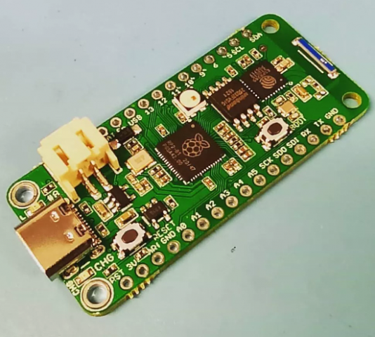

# Challenger RP2040 WiFi

The [iLabs Challenger RP2040 WiFi](https://ilabs.se/product/challenger-2040-wifi/) is basically a
Raspberry Pi Pico (RP2040) in Feather format with an **ESP8285** Wi-Fi co-processor running the
Espressif **AT firmware** on a UART.

## What's inside

| Path | Content |
|---|---|
| `CIRCUITPY/code.py` | Demo: NeoPixel test, Wi-Fi scan, connection (via `adafruit_espatcontrol`) |
| `CIRCUITPY/lib/challenger2040wifi.py` | Pin map extracted from the Arduino `pins_arduino.h` (for generic Pico firmware) |
| `CIRCUITPY/settings.toml` | Wi-Fi credentials template |
| `ressources/` | Original Arduino variant files (`pins_arduino.h`, `ChallengerWiFi.cpp/.h`) |

## Install (CircuitPython 9 / 10)

1. Flash the official **"iLabs Challenger RP2040 WiFi"** CircuitPython build from
   [circuitpython.org](https://circuitpython.org/downloads) (or the Raspberry Pi Pico build: the
   demo falls back to the raw GPIO numbers).
2. Copy the content of `CIRCUITPY/` to the board.
3. Install the libraries: `pip install circup` then `circup install -r requirements.txt`.
4. Put your Wi-Fi credentials in `settings.toml`.

| Signal | GPIO |
|---|---|
| ESP8285 TX / RX (UART) | GP4 / GP5 |
| ESP8285 reset | GP19 |
| ESP8285 mode (high = run) | GP13 |
| LED | GP12 |

## Useful links

- <https://github.com/earlephilhower/arduino-pico/tree/master/variants/challenger_2040_wifi>
- <https://github.com/adafruit/Adafruit_CircuitPython_ESP_ATcontrol>
