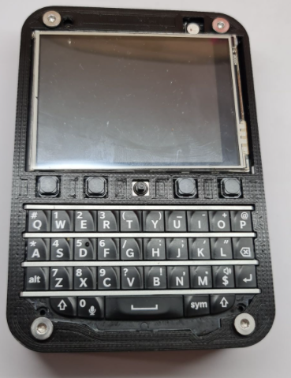

# Keyboard FeatherWing

Code for the [Keyboard FeatherWing](https://www.solder.party/docs/keyboard-featherwing/)
(BlackBerry Q10 keyboard, 320×240 ILI9341 touch screen, NeoPixel, micro SD).

| Folder | Board | Content |
|---|---|---|
| `FeatherS2/` | Unexpected Maker FeatherS2 (ESP32-S2) | Keyboard-driven boot menu (`code.py`), calculator, factory test, DuckyScript HID test |
| `M4_Express_Feather/` | Adafruit Feather M4 Express | Touch calculator, factory test, display examples |

Custom drivers in `lib/`: `bbq10keyboard.py` (keyboard), `tsc2004.py` (touch),
`kfw_FeatherS2_board.py` (pin map), `keyboard_layout_fr.py` (French AZERTY HID layout).

## Install (CircuitPython 9 / 10)

1. Copy the content of the folder that matches your Feather to the board.
2. `pip install circup` then `circup install -r requirements.txt`.

## FeatherS2 boot menu

Use the joystick up / down to select a `.py` file at the root of CIRCUITPY and press it to run it.
The chosen file is stored in the NVM and launched after the reset; when it ends, the board
resets and the menu comes back.
