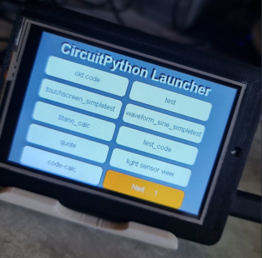
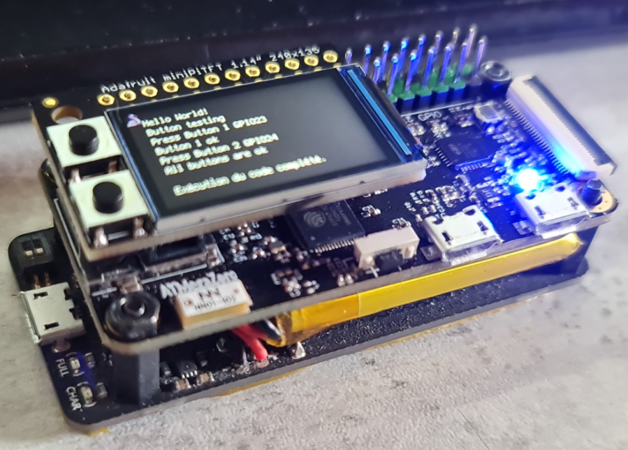
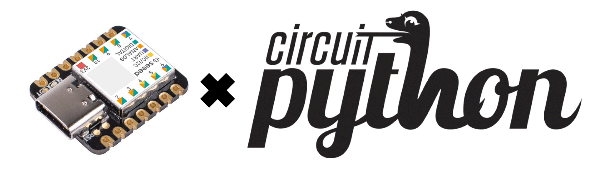
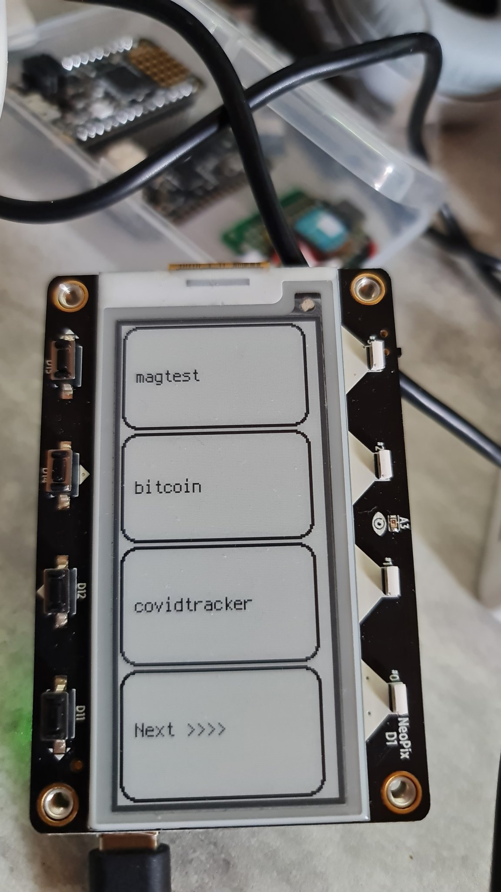
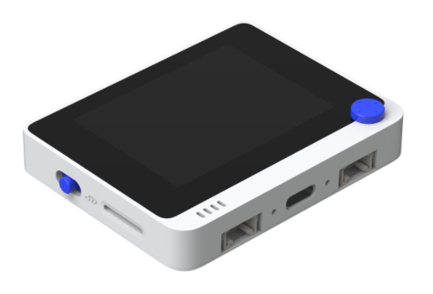

# Welcome to BeBoXoS CircuitPython repository

On my repository you will find all my [CircuitPython](https://circuitpython.org) projects:
launchers, mini OS, HID tools, games and demos for many boards.

> **2026 refresh**: the projects have been updated for **CircuitPython 9 / 10**
> (`display.root_group`, `fourwire`, `settings.toml`, `supervisor.set_next_code_file()`...).
> The Adafruit libraries are no longer stored in the repository: each project has a
> `requirements.txt` to install up-to-date versions with [circup](https://github.com/adafruit/circup).
> See [ROADMAP.md](ROADMAP.md) for the upgrade ideas.

## Quick start

```sh
pip install circup              # once
cd "<project>/CIRCUITPY"        # the folder you copy to the board
circup install -r requirements.txt
```

## Projects

| Project | Board | Status |
|---|---|---|
| [BasicPython](#basic-python-for-pyportal-works-on-wio-terminal-too) | PyPortal Titano, Wio Terminal, any board | ✅ v0.05 (2026) |
| [CircuitPython Launcher](#circuitpython-launcher-for-adafruit-pyportal-titano) | PyPortal Titano | ✅ v2.0 (2026) |
| [T-Embed timer](#lilygo-t-embed) | LilyGO T-Embed ESP32-S3 | ✅ v2.0 (2026) |
| [BadgerOS](#circuitpython-badgeros-for-pimoroni-badger2040) | Pimoroni Badger 2040 | 🔧 CP 9 API migrated |
| [Keyboard FeatherWing](#keyboard-featherwing) | FeatherS2, Feather M4 Express | 🔧 CP 9 API migrated |
| [Pico RGB Keypad DuckyPad](#pico-rgb-keypad) | Raspberry Pi Pico | 🔧 CP 9 API migrated |
| [Challenger 2040 WiFi](#challenger-2040-wifi-feather) | iLabs Challenger RP2040 WiFi | ✅ v2.0 Wi-Fi demo (2026) |
| [ATMegaZero S2](#atmegazero-s2) | ATMegaZero ESP32-S2 | 🔧 CP 9 API migrated |
| [Seeed XIAO UART to HID](#seeed-xiao) | Seeed XIAO SAMD21 | 🔧 libraries updated |
| [MagTag Boot App Selector](#adafruit-magtag) | Adafruit MagTag | 🔧 `settings.toml`, OpenWeather fix |
| [Wio SmartTerminal](#seeed-wio-terminal) | Seeed Wio Terminal | 🔧 to test |

✅ rewritten and tested on desktop — 🔧 migrated, to be tested on the board


# CircuitPython BadgerOS for Pimoroni Badger2040


[click here to go to this section](badger2040)


# CircuitPython launcher for Adafruit PyPortal titano



A touch application launcher for CircuitPython: 8 apps per page, apps from `/` and `/apps`,
automatic return to the menu when an app ends.
[Click here to go to this section](<pyportal titano/Circuitpyton launcher>)


# Basic Python for PyPortal (Works on Wio Terminal too!)

Based on the wonderful piece of code by Scott Shawcroft, original version from https://github.com/tannewt/basicpython.
Originally it is an experiment to edit Python code like BASIC was edited. The idea is to imagine this as the default mode on a Raspberry Pi 400.

I ported it to Adafruit PyPortal Titano CircuitPython (works on Wio Terminal under CircuitPython too).

It works with the I2C M5Stack CardKB keyboard and, since v0.05, with **any terminal over USB
serial** when no CardKB is connected. v0.05 adds `edit`, `auto`, `ins`, `find`, `vars`,
`history`, REPL-like expression echo, `input()` support, Ctrl+C and much more.

This makes our little gadgets autonomous for running and coding on the go.

Enjoy!


[Click here to jump directly to this section](<pyportal titano/basicpython>) —
user's manual in [English](<pyportal titano/basicpython/Readme.md>) and
[French](<pyportal titano/basicpython/Readme_FR.md>).


# LilyGO T-Embed

Kitchen timer with rotary encoder, LED ring progress, pause / resume and beeps.
[Click here to access this section](T-embed)


# Keyboard Featherwing


All my code for Keyboard Featherwing ([section README](Keyboard_Featherwing))
* [Code for Feather S2](Keyboard_Featherwing/FeatherS2)
* [Code for Feather M4 Express](Keyboard_Featherwing/M4_Express_Feather)


# pico RGB keypad


All my code for Raspberry Pi pico RGB keypad: a 16 keys DuckyScript macro pad.

[Click here to access this section](<pico RGB Keyboard>)


# Challenger 2040 wifi Feather


[Click here to access my section for Challenger2040Wifi](Challenger2040WiFi) (basically a Pico RP2040 with an ESP8285 Wi-Fi
co-processor, now driven with `adafruit_espatcontrol`)


# ATMegaZero S2



All examples etc made for this card [can be found here](<ATMegaZero S2>)


# Seeed XIAO



In this [section you will find all my codes for Seeed Xiao](<Seeed XIAO>) including my [UART to HID code](<Seeed XIAO/UartToHID>).


# Adafruit MagTag



[Here you can find all apps for this device](MagTag)


# Seeed Wio Terminal



[Here you can find all my code for the Wio Terminal](<WIO terminal>)

---

Also in this repository: [CircuitPython tricks.pdf](<CircuitPython tricks.pdf>).

License: [MIT](LICENSE) — more on twitter: [@BeBoXoS](https://twitter.com/BeBoXoS)
