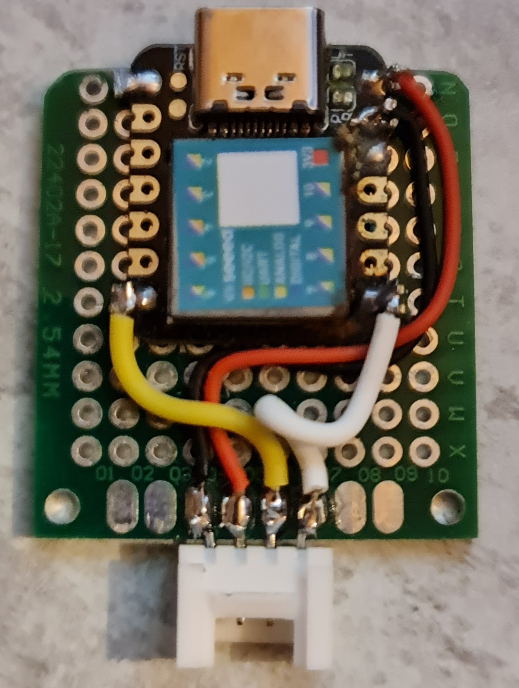

<h1> UART to HID </h1>

1. What is for ?

this little code is to use a seeed xiao as HID proxy. For example an ESP32 can't have HID function. with UART to HID you can manage keyboard stroke thru command sended over UART.
language command is simple because it's the well known [Hak5 Rubber ducky language](https://docs.hak5.org/hc/en-us/articles/360010555153-Ducky-Script-the-USB-Rubber-Ducky-language).

i added a little trick that let you use XIAO as classic autonomous USB rubber ducky like. At boot le script start by running all commands in boot.txt (in [this example](https://github.com/beboxos/circuitpython/blob/main/Seeed%20XIAO/UartToHID/boot.txt) at start wait 1 second then press GUI aka windows key then wait 1 second and press again GUI key) once code is finished it start waiting commands on UART.

i fixed speed to classic 9600 bauds.

i build and hardware with grove plug to be compatible with M5stack devices

then here is an example of code on m5stack core 2 UIFLOW

