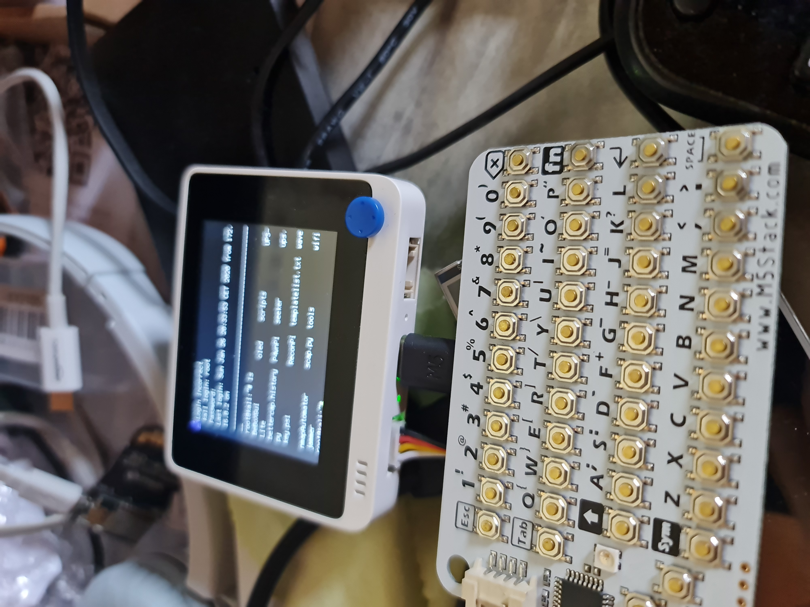

# Wio Terminal as Smart Linux Terminal

Under linux, you can redirect the terminal output to a serial link. That's how this little piece of code works and as serial links are bi-directional you can also send commands to the linux terminal by this way. In this case the WIO terminal acts as a terminal (display and send commands) for the Raspberry pi. So there are limitations in the commands, we can't have a graphical environment. 
## prepare the Raspberry PI
on the boot you need to edit 2 files : 
- From cmdline.txt remove "console=tty1"
- From config.txt add 3 lines
	- enable_uart=1
	- corefreq=250
	- init_uart_baud=115200

that's it for the PI linux part, on next boot console will be redirected to UART

## part list 

[a m5stack i2c CardKB (optional but usefull to interact with PI)](https://shop.m5stack.com/products/cardkb-mini-keyboard)

[of course a WIO terminal from seeed under circuitpython](https://www.seeedstudio.com/Wio-Terminal-p-4509.html)

## add on

i inclued and example to use button 1 of wio terminal to login (example for kali linux root/toor)