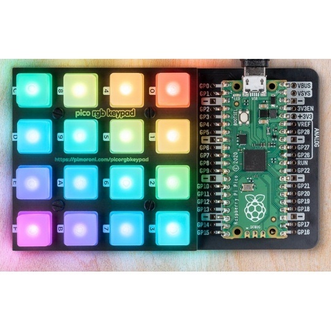

# Pimoroni Pico RGB Keypad

## DuckyPad

`DuckyPad/` turns the [Pico RGB Keypad](https://shop.pimoroni.com/products/pico-rgb-keypad-base)
into a 16-key macro pad: each key types a [DuckyScript](https://docs.hak5.org/hak5-usb-rubber-ducky)
file over USB HID.

### v2.0 (2026) — pages + media keys

- **Bottom-right key (15)** cycles pages; each page has its own LED color.
- **Keys 0..14** run that page's DuckyScript, or send a media key on the MEDIA page.
- Pages come from `ducky/`:
  - `ducky/1/0.txt` … `ducky/1/E.txt` (page 1), `ducky/2/…` (page 2), …
  - with no numbered sub-folders, the flat `ducky/0.txt` … `E.txt` is page 1 (old layouts keep working).
  - a built-in **MEDIA** page is always added last: Vol-, Vol+, Mute, Play/Pause, Next, Prev, Stop.
- The pressed key lights up red while its script runs.
- Keyboard layout: edit `hid_layout.py` (`"fr"` = French AZERTY with AltGr support, `"us"`).
- `lib/ducky_bebox.py` is a modified `adafruit_ducky` (ALTGR key, a single command can be passed
  instead of a file name). It has its own name so `circup update` never overwrites it.

### Install (CircuitPython 9 / 10)

1. Flash the Raspberry Pi Pico CircuitPython build.
2. Copy the content of `DuckyPad/` to the board.
3. `pip install circup` then `circup install -r requirements.txt`.

> ⚠️ Only use HID scripts on computers you own or are allowed to use.
