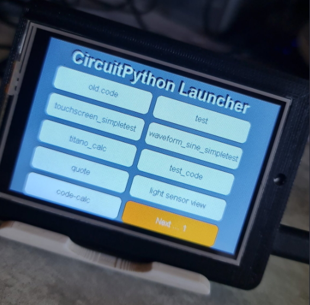

<h1> Circuitpython Launcher For Pyportal Titano </h1>

  

Welcome to the Circuitpython launcher section.  
  
This launcher can bring 8 pages of 8 programs, that is 64 entries.  
It builds itself from the files present at the root of CIRCUITPY.   
by default are excluded from the list the files :  
* code.py (itself) 
* secrets.py (no interest) 
* (and calculator.py because it is a module of calculation for the calculator application titano_calc).
  
the limit of the file names is 24 characters (.py included) that is to say 21 characters because it stores in the non-volatile memory (in the 25 first bytes) the file name to be launched at the next reset.  
  
 
If you want to exclude other files you can always add them in [code.py at line 121](https://github.com/beboxos/circuitpython/blob/a470852d9fb7b90fc01971e96d4b7b3bbc51355a/pyportal%20titano/Circuitpyton%20launcher/code.py#L121)

When you write your application to leave and return to the menu, it is enough to make a reset of your card for that 3 cases:  
* Press the reset button of your card
* Cut and put back the power supply 
* Import microcontroller and use the command microcontroller.reset()
  
You can see the examples I put to see microcontroller.reset() in action.  
For some reason, it happens sometimes, that some python script doesn't work and I am trying to understand why.   

Several reasons:   
* The fact of calling python files via the OS lib with exec(open()) poses a problem (I would have to see if there is a way to pass by an import
* Unsupported characters in the file name 

**possible / future improvements :**   
* Take into account the fact of navigating the menu via physical buttons (for devices without touch functions).
* Read the files to launch from an SD card (for cards without much memory)
* The possibility to switch to landscape or portrait mode
